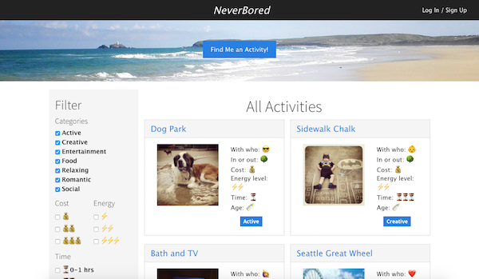
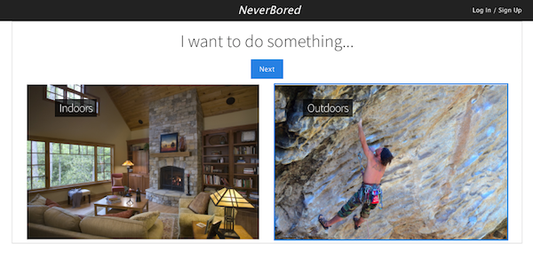
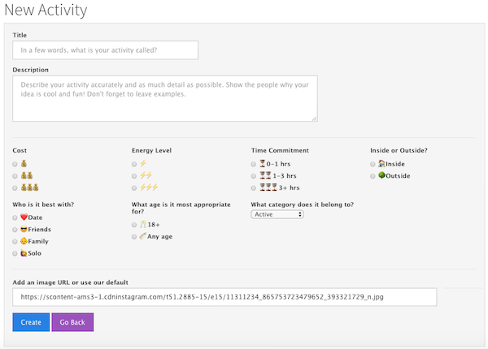

# NeverBored
An app to help cure boredom! NeverBored is a community-driven web-app for collecting and sharing activity ideas that inspire users to find new and fun experiences with friends, family, a date, or while riding solo!

Developed April 2017

## Features

The homepage will populate randomly posted activities for the user to explore. Activity details are provided (such as time commitment, energy level, cost, etc.)

#### Find an Activity

(Left:) Filter activities based on categories and activity attributes. Results will update in real-time on the page.

 | 

(Right:) The "Find an Activity" guide walks the user through a series of questions to narrow down a custom, randomized activity that fits their selected criteria.

#### Users
Registered users can create a new activities to add to the public collection.

#### Future Development

- Users can leave review comments on activities
- Activities are grouped by location/city
- Users can upload their own images

## Usage and Installation
A deployed version of this web app can be viewed on Heroku:
https://never-bored.herokuapp.com/

To download and view the code, fork and clone the repository and run 'npm install' to download the required dependencies.

## Technology

##### Frontend
- JavaScript
- jQuery
- Handlebars
- Bootstrap

##### Backend
- Node.js
- ExpressJS
- PostgreSQL
- Knex.js

## View Our Project

https://never-bored.herokuapp.com/

## Developed by | April 2017

John Seymour: https://github.com/andromeda111

Alyssa Evans: https://github.com/missalyss

Amalia Fergin: https://github.com/amaliaclaire
